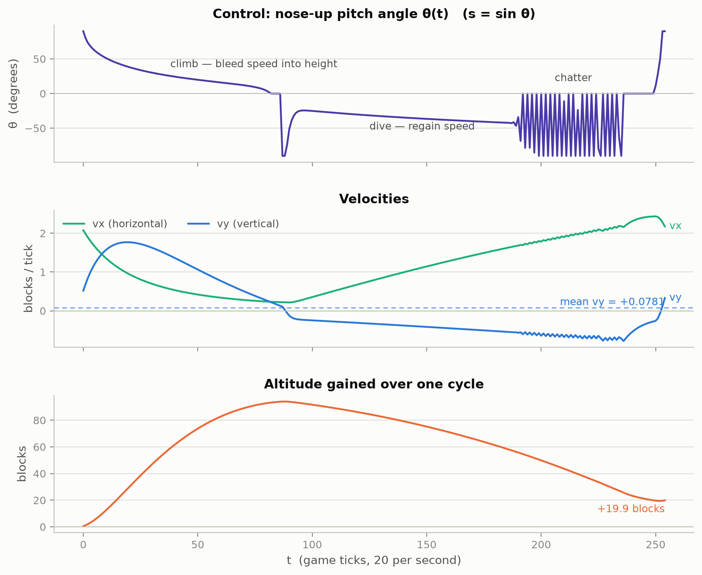
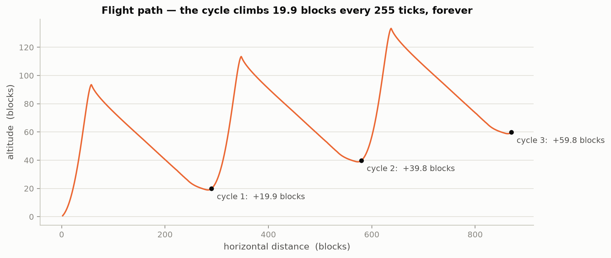
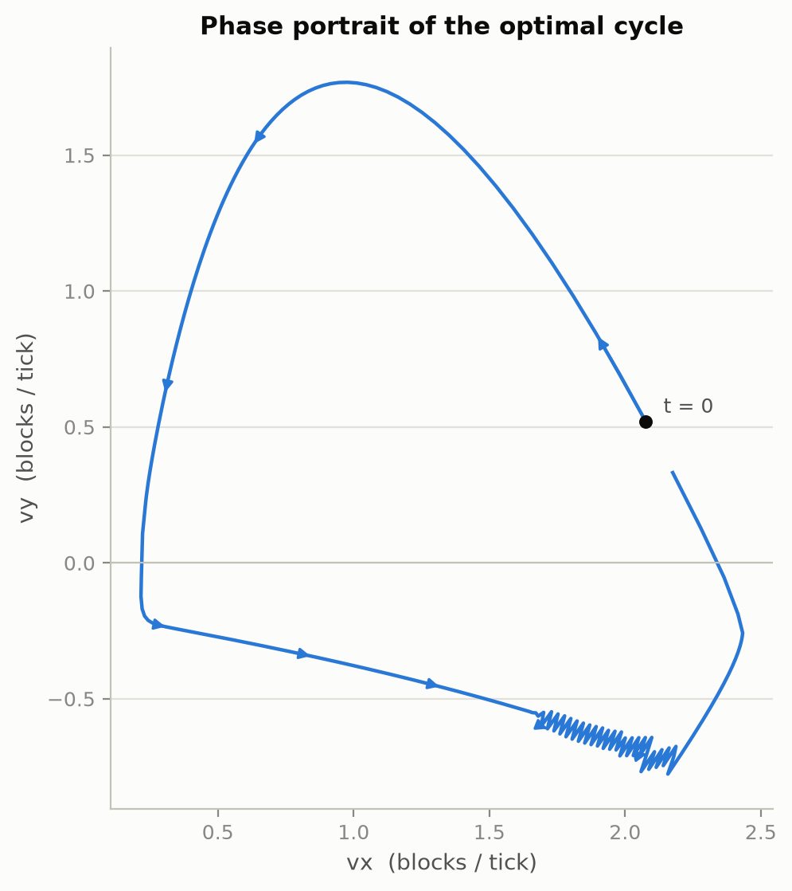
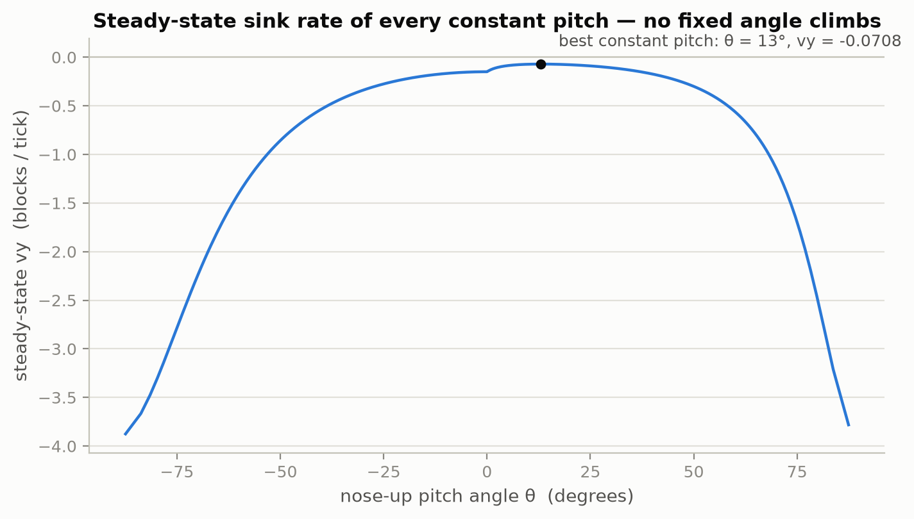
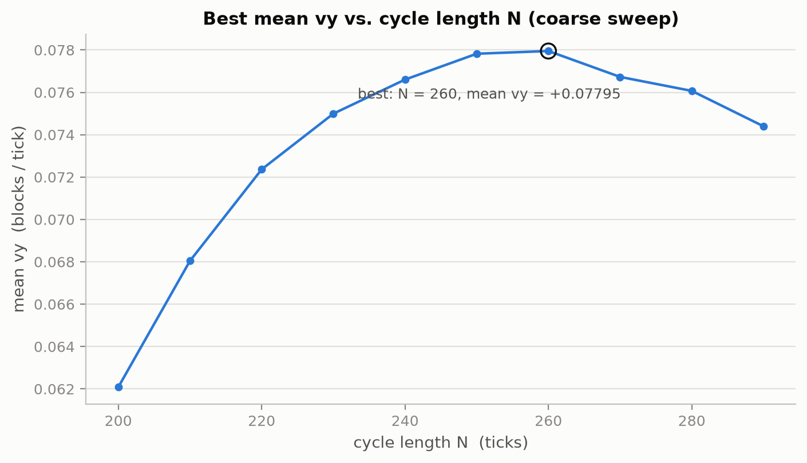
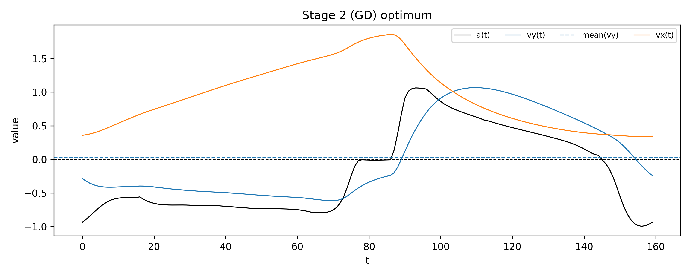
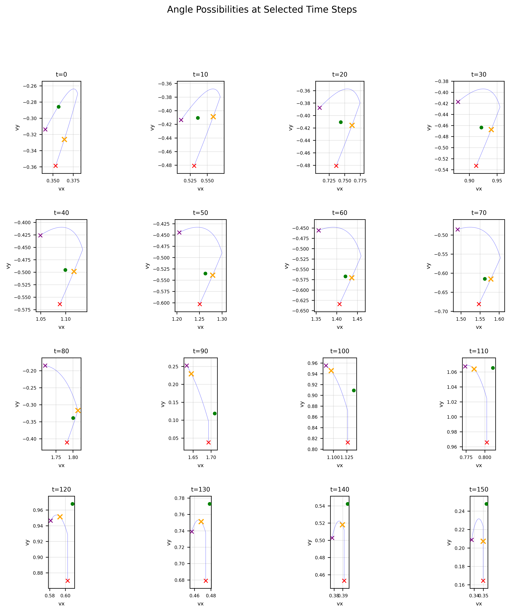

# elytra — optimal control of Minecraft elytra flight

What is the best possible way to fly an elytra, using nothing but pitch control — no rockets, no potions?

The elytra tick physics (decompiled in [`elytra_raw.java`](elytra_raw.java), 1.9–1.11 era) reduce, for planar flight with the look direction aligned to the motion, to a two-state recurrence over horizontal speed `vx` and vertical speed `vy` with a single control `s = sin θ ∈ [-1, 1]`, where θ is the nose-up pitch angle ([`elytra_min.py`](elytra_min.py)):

```python
def next_vx_vy(vx, vy, s):
    c2 = 1 - s * s            # cos²(pitch)
    vx0 = vx
    vy += 0.06 * c2 - 0.08    # lift from wing area minus gravity
    if vy < 0:                # falling: wing converts sink into forward speed
        ty = 0.1 * vy * c2
        vx -= ty
        vy -= ty
    if s > 0:                 # nose up: forward speed converts into climb, 3.2x
        tx = 0.04 * vx0 * s
        vx -= tx
        vy += 3.2 * tx
    vx += 0.1 * (vx0 - vx)
    return 0.99 * vx, 0.98 * vy
```

The objective is the long-run **mean vertical velocity** `mean(vy)`: any strategy with `mean(vy) > 0` climbs forever.

## Main result: a 255-tick pitch-pumping cycle that climbs forever

The best strategy found is a periodic cycle of **N = 255 ticks** (12.75 s), stored in [`cycle_opt_outputs/solution_N255.csv`](cycle_opt_outputs/solution_N255.csv):

| metric | value |
|---|---|
| mean `vy` | **+0.07812 blocks/tick ≈ 1.56 blocks/s climb** |
| altitude gained per cycle | +19.9 blocks per 12.75 s |
| mean `vx` | 1.137 blocks/tick ≈ 22.7 blocks/s (290 blocks per cycle) |
| net climb gradient | ≈ +3.9° |
| periodicity | re-simulating the stored control with the exact float dynamics returns to the start state to within 1e-13 |

For reference, **no constant pitch can climb at all** — the best fixed angle (θ ≈ 13° nose-up) still sinks at 0.071 blocks/tick — so sustained climbing is only possible by *pumping*: cycling between a climb that spends speed and a dive that regains it.



The cycle has three phases:

1. **Climb** (≈ ticks 0–86, `s > 0`): starting fast (`vx ≈ 2.1`) and pointed almost straight up, the nose-up branch (`vy += 3.2 · 0.04 · vx · s`) converts horizontal speed into vertical speed at a 3.2× exchange rate. Pitch eases smoothly from 90° down to 0° as speed bleeds off; altitude peaks **+94 blocks** above the cycle start at t ≈ 88.
2. **Dive** (≈ ticks 87–187, `s < 0`): a sharp nose-down transient to −90°, then a shallow dive deepening from θ ≈ −25° to −42°. While falling, the wing branch (`0.1 · vy · cos²θ`) pumps sink back into forward speed, rebuilding `vx` to ≈ 2.4 while giving back ≈ 74 of the 94 blocks.
3. **Chatter** (≈ ticks 188–250): the solver alternates between θ ≈ −90° and θ ≈ 0° almost every tick — a bang-bang regime that squeezes out the last bit of speed with minimal height loss — before snapping back to straight-up for the next climb. This chatter is not solver noise: it survives polishing at tolerance 1e-12.

Repeating the cycle produces a sawtooth flight path that gains ~20 blocks per period:



In the (vx, vy) phase plane the strategy is a closed loop — the chatter appears as the small zigzag at the bottom right:



### Why a cycle is necessary

The steady-state sink rate is negative for every fixed pitch angle. Gliding at the best constant angle loses 1.4 blocks/s; only trading speed for height and back beats gravity:



### Cycle length

A coarse sweep over the cycle length ([`cycle_100_1000.py`](cycle_100_1000.py)) puts the optimum near **N ≈ 250–260 ticks**; the sweep values are slightly below the polished N = 255 solution because each per-N solve ran under a tight CPU cap:



## How the optimum was found

Three independent approaches, in increasing order of final solution quality:

### 1. CMA-ES + gradient descent ([`main_cme_gd.py`](main_cme_gd.py))

The recurrence is rewritten as a differentiable PyTorch simulator (`torch.where` instead of branches). The control is parametrised as an initial angle plus cumulative slopes of `tan θ`, the cycle constraint enforced with a penalty `10 · ‖v_T − v_0‖²`, and optimised in two stages for a T = 160 cycle:

- **Stage 1 — CMA-ES** (10k evaluations, 13 parameters: `log vx0`, `vy0`, `θ0` + 10 piecewise slopes): global search that discovers the pump–dive shape with `mean(vy)` just above 0.
- **Stage 2 — Adam** (per-tick slopes, ~2–3k iterations): polishes it to `mean(vy) ≈ +0.03` — the first proof that indefinite climbing is possible.



A useful diagnostic from this stage: at each state, the set of reachable next-tick `(vx, vy)` over all pitch angles is a curve, and the optimiser's choice (orange ×) rides its upper edge:



### 2. Pontryagin maximum principle ([`main_pmp.py`](main_pmp.py))

A discrete-time PMP solver: costate recursion `λ_t = ∂ℓ/∂v + (∂f/∂v)ᵀ λ_{t+1}`, per-tick 1-D maximisation of the Hamiltonian over `s`, and low-dimensional shooting on the terminal multipliers (JAX autodiff with a finite-difference fallback). Used to study the fixed-branch subproblems and the local optimality structure rather than to set the record.

### 3. Direct collocation with IPOPT — best results ([`cycle_opt_toolkit.py`](cycle_opt_toolkit.py), [`main_ipopt_trials.py`](main_ipopt_trials.py))

The winning formulation treats all states and controls of one period as decision variables (CasADi/IPOPT), with the dynamics and the periodicity `v_N = v_0` as equality constraints. The two `if` branches are handled by a **frozen-regime outer loop**: fix each tick's branch pattern, solve the resulting smooth NLP, re-derive the branch pattern from the solution, repeat until it stabilises. Sign-consistency inequalities keep each solve inside its regime, and an anchor constraint `s[0] = max(s)` removes the cyclic-shift degeneracy. Multi-start over structured initial guesses (piecewise pump–dive shapes, sinusoids, random walks, bang-bang, warm starts resampled across N) plus a final polish at tolerance 1e-12 yields the **N = 255 cycle with `mean(vy) = +0.078118`**.

Interactive Plotly versions of the solution are in [`cycle_opt_outputs/`](cycle_opt_outputs/) (`timeseries_N255.html`, `phase_N255.html`).

| approach | best mean `vy` (blocks/tick) | role |
|---|---|---|
| best constant pitch | −0.0708 | baseline: always sinks |
| CMA-ES (T = 160) | ≈ +0.005 | global search, finds the cycle shape |
| CMA-ES + Adam (T = 160) | ≈ +0.03 | first climbing strategy |
| IPOPT, frozen regimes (N = 255) | **+0.0781** | best known strategy |

## Reproducing

```bash
uv sync

uv run python main_cme_gd.py                                # CMA-ES + Adam, T=160
uv run python main_ipopt_trials.py --N 255 --trials 100 --verbose
uv run python cycle_opt_toolkit.py                          # best-known N=255 solve + HTML plots
uv run python cycle_100_1000.py                             # cycle-length sweep
uv run python make_readme_plots.py                          # regenerate the figures above
```

## Repository layout

| file | contents |
|---|---|
| `elytra_raw.java` | decompiled elytra tick code |
| `elytra_min.py` | minimal 2-state recurrence (the model) |
| `main_cme_gd.py` | CMA-ES + Adam on a differentiable PyTorch simulator |
| `main_pmp.py` | discrete-time Pontryagin solver (shooting + costates) |
| `main_ipopt_trials.py` | single-N CasADi/IPOPT solve from multi-start trials |
| `cycle_opt_toolkit.py` | multi-start frozen-regime IPOPT toolkit — produced the best solution |
| `cycle_100_1000.py` | cycle-length sweep with warm-starting across N |
| `make_readme_plots.py` | regenerates `docs/img/*.png` from the stored solution |
| `cycle_opt_outputs/`, `cycle_length_sweep_100_1000_outputs/`, `outputs/` | solution CSVs, trial summaries, plots |

## Caveats

- The model is a 2-D reduction: yaw is assumed aligned with the horizontal velocity and the look vector has unit length (`min(1, d1/0.4) = 1`). Position, collision and the 3-D rotation code are ignored.
- Pitch changes are instantaneous between ticks (the mouse can do this, but a real player cannot do it with 1e-9 precision).
- The physics is the 1.9–1.11-era elytra code; later versions changed elytra behaviour.
- All optima are local: the frozen-regime NLP certifies a KKT point per regime pattern, and the multi-start + sweep make the N ≈ 255 cycle the best *known* strategy, not a proven global optimum. The bang-bang chatter suggests the true continuous-limit optimum involves a singular arc.
